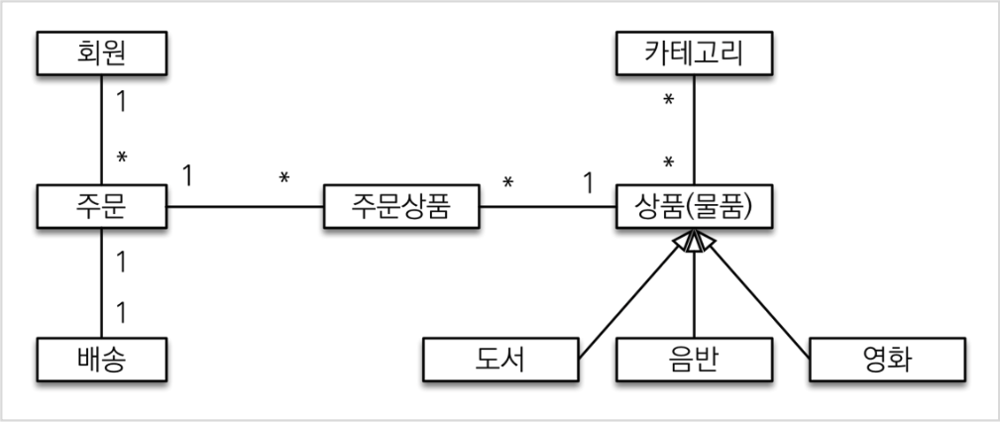
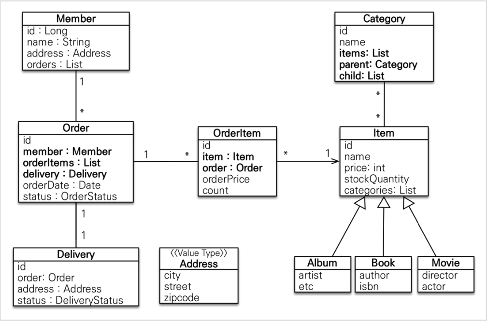
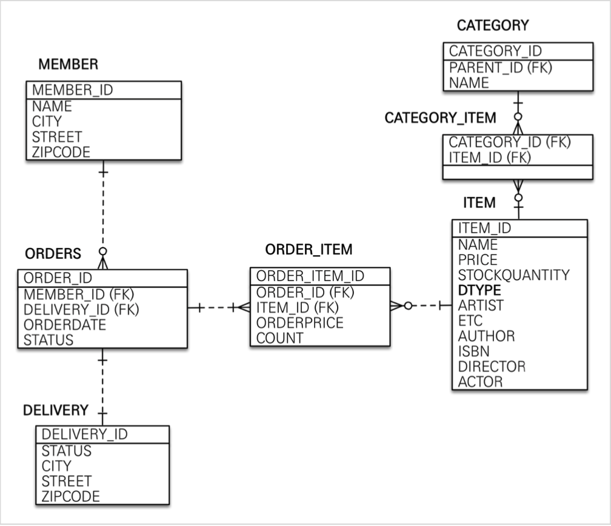

김영한의 "실전! 스프링 부트와 JPA 활용1 - 웹 애플리케이션 개발"을 수강하며 작성한 Code를 저장한 Repository입니다.

## 다이어그램

### 도메인 다이어그램
</img>

### 엔티티 다이어그램 
</img>

### 엔티티 릴레이션 다이어그램
</img>


## 세팅

### Lombok 세팅

1. preference 열기
2. plugins 선택
3. market 탭 선택
4. lombok 설치
4. Apply 선택
5. OK 선택
1. 다시 preference 열기
2. annotation processors 검색
3. enable annotation processing 체크
4. Apply 선택
5. OK 선택

### Build 세팅
이것을 해야 build가 빨라지고 test에서 intellij에 testName이 표시된다.

1. preference
1. gradle 검색
1. build and running using: intellij idea 선택
1. run tests using: intellij idea 선택
1. OK 선택


### Live Template 세팅

edit창에 ttd 입력으로 템플릿 뜰 수 있도록 만들기

1. preference 열기
1. live template 검색
1. add 버튼 클릭
1. group template 선택
1. "custom" 입력
1. OK 클릭
1. add 버튼 클릭
1. live template 선택
1. "ttd" 입력
1. 아래 내용 입력
```java
@Test
public void $Name$() throws Exception {
 // Given
 $End$
 // When

 // Then
}

```
11. OK 버튼 클릭


### 사용되는 라이브러리

1. spring-web
1. thymeleaf
1. lombok
1. h2
1. jpa
1. devtools (html화면에서 build-> recompile하면 서버 재시작안하고 파일만 recompile한다.)
```
implementation 'org.springframework.boot:spring-boot-devtools'
```
